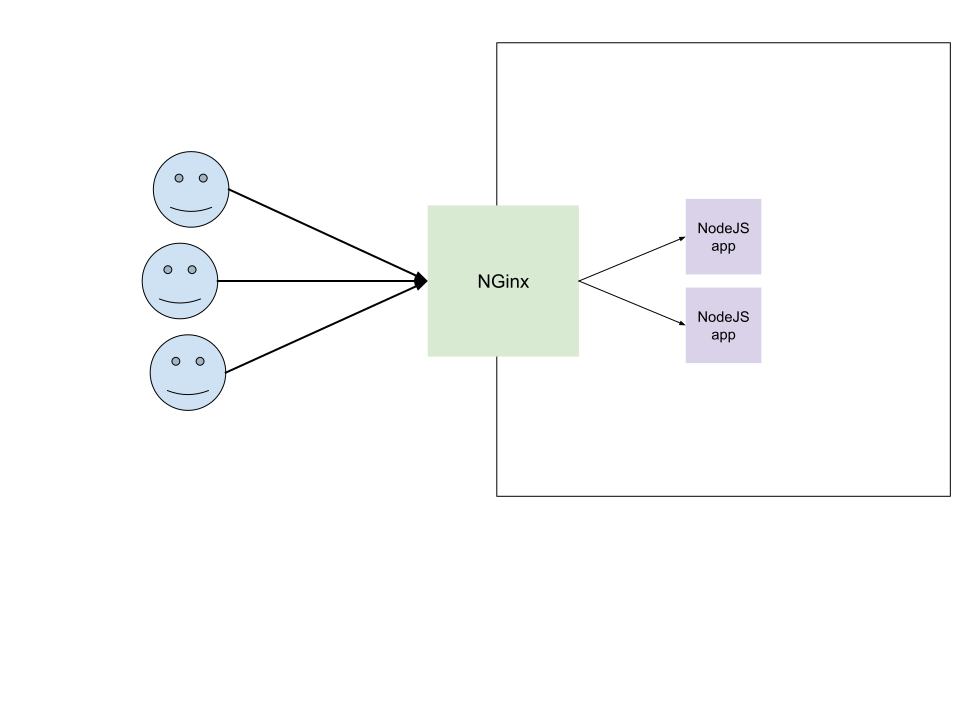

# Etude de cas sécurité SI « secu web »

[consignes (pdf)](https://teams.microsoft.com/l/file/e47613ce-619b-432e-82dd-377b4b5b75b5?tenantId=8a2f18a9-8f0e-4f76-a585-9b07b3a38dea&fileType=pdf&objectUrl=https%3A%2F%2Feduservices.sharepoint.com%2Fsites%2FM1ESI333%2FDocuments%20partages%2FSECURISATION%20DU%20CODE%2FNFConsulting_secuWeb%20I1%20MDS%20Rennes.pdf&baseUrl=https%3A%2F%2Feduservices.sharepoint.com%2Fsites%2FM1ESI333&serviceName=teams&threadId=19:44220b72aa934a5ca67aba8e06c84dc7@thread.tacv2&messageId=1614673973035&groupId=b164e3e9-dad8-4e03-badf-910b4c64802a)


- Serveur
  - [x] load-balancing
  - [x] HTTP proxy
  - [x] HTTPS
  - [x] Certificat auto-signé
- Base de données
  - [ ] création
  - [ ] *chiffrement  de  la  base*
- WAF
  - [ ] protection contre : *utilisation par un adresse IP non autorisées*
  - [x] documentation

- Souhaitable :
  - [ ]  virtualisation  ou  dockerisation


## [Github repository](https://github.com/MDS-Etude-de-cas-securite-SI/TP)

## Sommaire
  - [Architecture du serveur](#architecture-du-serveur)
  - [WAF](#waf)
    - [NGINX Plus](#nginx-plus)
      - [Distributions supportées](#distributions-supportées)
      - [Fonctionnement](#fonctionnement)

<hr>

## Architecture du serveur

L'application tourne en NodeJS et plusieurs instances sont créées à l'aide de PM2. NGinx est utilisé en tant que reverse proxy et permet de répartir la charge en redirigeant les utilisateurs vers une instance ou une autre à l'aide de l'algorithme "Round-robin" (tourniquet), la charge est alors répartie de manière uniforme et prend en compte les poids (si définis). D'autre méthodes de répartition de charge peuvent être configurés : "Least connections", "IP Hash", "Generic hash", "Least time".



Le serveur est accessible en HTTP et en HTTPS, bien que le certificat pour le HTTPS soit auto-signé. (Aucun autorité de certification n'a validé notre certificat.)

### Fonctionnement de l'application
> (voir [serveur README](./server/README.md))

Le serveur répond en envoyant la vue HTML lorsqu'on accède à la racine.
```js
// ./server/routes/index.js

const express = require('express');
const path = require('path');

const router = express.Router();
const app = express();

router.get('/', (req, res) => {
  // res.send('ACCUEIL');
  res.sendFile(path.join(__dirname + '/../views/index.html'));
});

app.use('/', router);

app.listen(process.argv[2] || process.env.PORT || 3000, () => {
  console.log("Le serveur est en écoute sur ${process.argv[2] || process.env.PORT || 3000} et ${process.argv[2] || process.env.PORT || 3001}");
});
```

Le HTML étant un simple formulaire de création de compte :
```html
<!-- ./server/views/index.html -->

<!DOCTYPE html>
<html lang="fr">
<head>
<!-- [...] -->
</head>

<body>
  <section>
    <h1>The formulaire</h1>
    <form action="/" method="post">
      <label for="nom">Nom</label>
      <input autocomplete="off" type="text" name="nom" id="nom">
      <label for="prenom">Prénom</label>
      <input autocomplete="off" type="text" name="prenom" id="prenom">
      <label for="date">Date de naissance</label>
      <input autocomplete="off" type="date" name="date" id="date">
      <label for="mail">Adresse mail</label>
      <input autocomplete="off" type="email" name="mail" id="mail">
      <label for="telephone">Telephone</label>
      <input autocomplete="off" type="tel" name="telephone" id="telephone">
      <label for="postal">Code postal</label>
      <input autocomplete="off" type="text" name="postal" id="postal">
      <input autocomplete="off" type="submit" value="Envoyer">
    </form>
  </section>
</body>

</html>

```


## WAF

> Le repo étant basé pour une utilisation Windows, l'application n'intègre pas de WAF ([raison](#distributions-support%C3%A9es)).
À défaut, voici une explication du WAF et d'une possible intégration :


Un WAF (Web Application Firewall) sert à protéger les applications web en surveillant et filtrant le trafic HTTP avant même l'accès à l'application.
Il agit comme une sorte de bouclier pour l’application et protège des attaques XSS, d’inclusion de fichier et d’injection SQL.


Il existe deux types de fonctionnement du WAF, il peut-être basé sur une liste noire (*ModSecurity de Nginx*) ou bien sur liste blanche (*NAXSI*).

S’il est basé sur liste noire, le WAF filtrera le trafic HTTP sur une base donnée, appelée signature, c’est-à-dire qu’à l’aide d’une regex représentant les différents types d’attaque possible, il saura refuser l'entrée aux requêtes reflétant un trafic dangereux.

À l’inverse, un WAF basé sur liste blanche quant-à lui laissera seulement les requêtes autorisées présentes dans la signature.

Un WAF possède d’autres caractéristiques comme :

* Prévenir les attaques et les accès non autorisés
* Prévention de fuite de données
* Empêcher ou détecter la falsification de jetons de session, par exemple en chiffrant des cookies de session, des champs de formulaire masqués ou en utilisant d'autres méthodes pouvant être utilisées par ceux qui suivent la session

> source: https://fr.wikipedia.org/wiki/Web_application_firewall#Les_caract.C3.A9ristiques_du_WAF


### NGINX Plus

NGINX Plus fournit une panoplie de fonctionnalités intégrées :
* load balancer
* content cache
* bew server
* API gateway
* microservice proxy

ainsi qu'*NGINX App Protect* incluant le WAF basé sur la technologie de sécurité de [F5](https://www.f5.com/) (*NGINX ModSecurity WAF*).

#### Distributions supportées

* Alpine Linux
* Amazon Linux
* CentOs
* Debian
* FreeBSD
* SLES
* Ubuntu

#### Fonctionnement

(Voir : https://docs.nginx.com/nginx-waf/admin-guide/nginx-plus-modsecurity-waf-installation-logging/#protecting-the-demo-web-application)

Pour utiliser *NGINX ModSecurity WAF* il faut modifier le fichier de configuration du reverse proxy en activant l'addon (`modsecurity on`) et en spécifiant l'adresse du fichier de configuration du WAF (`modsecurity_rules_file /etc/...`)
L'exemple fournit par NGINX :
```apacheconf
server {
    listen 80;
    modsecurity on;
    modsecurity_rules_file /etc/nginx/modsec/main.conf;
    location / {
        proxy_pass http://localhost:8085;
        proxy_set_header Host $host;
    }
}
```


<br>

___

PS : Amis Windows s’abstenir.